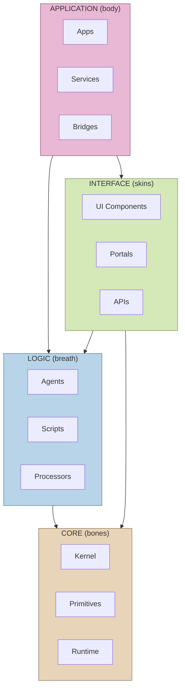
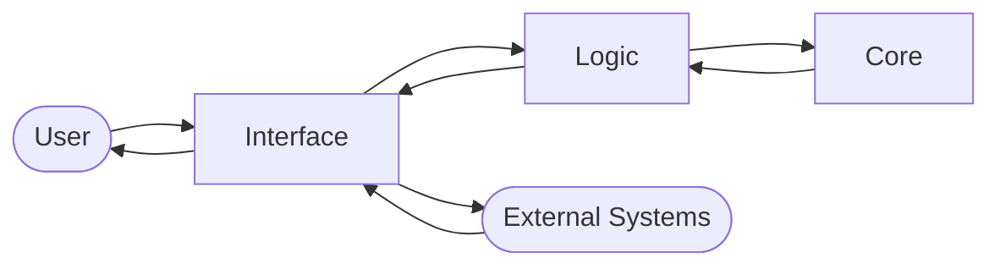

# Layer Architecture

Visual guide to the FUNCTIONcalled() four-layer system.

## Layer Diagram

## Layer Descriptions

### Core (bones)
**Languages:** C, C++, Rust, Go

The foundation layer. Code here is:
- Low-level and performance-critical
- Rarely changed once stable
- Depended upon by all other layers

**Examples:**
- `core.router.network.c` — Network routing primitives
- `core.engine.compute.rs` — Compute engine kernel

---

### Interface (skins)
**Languages:** HTML, CSS, JavaScript, PHP

The boundary layer. Code here:
- Translates between internal and external
- Handles user interaction
- Defines API surfaces

**Examples:**
- `interface.portal.entry.html` — Main entry portal
- `interface.layout.dashboard.css` — Dashboard styling

---

### Logic (breath)
**Languages:** Python, Lua, Ruby

The intelligence layer. Code here:
- Processes and transforms data
- Makes decisions
- Implements business rules

**Examples:**
- `logic.agent.analysis.py` — Analysis agent
- `logic.script.migration.rb` — Migration script

---

### Application (body)
**Languages:** Swift, Objective-C, Java

The embodiment layer. Code here:
- Brings everything together
- Creates runnable artifacts
- Bridges to platform-specific APIs

**Examples:**
- `application.app.mobile.swift` — iOS mobile app
- `application.bridge.legacy.m` — Legacy system bridge

## Data Flow

## Layer Dependencies

| Layer | Can Depend On |
|-------|---------------|
| Core | (none) |
| Logic | Core |
| Interface | Core, Logic |
| Application | Core, Logic, Interface |

> **Rule:** Layers can only depend on layers below them. Core is the foundation; Application sits at the top.
